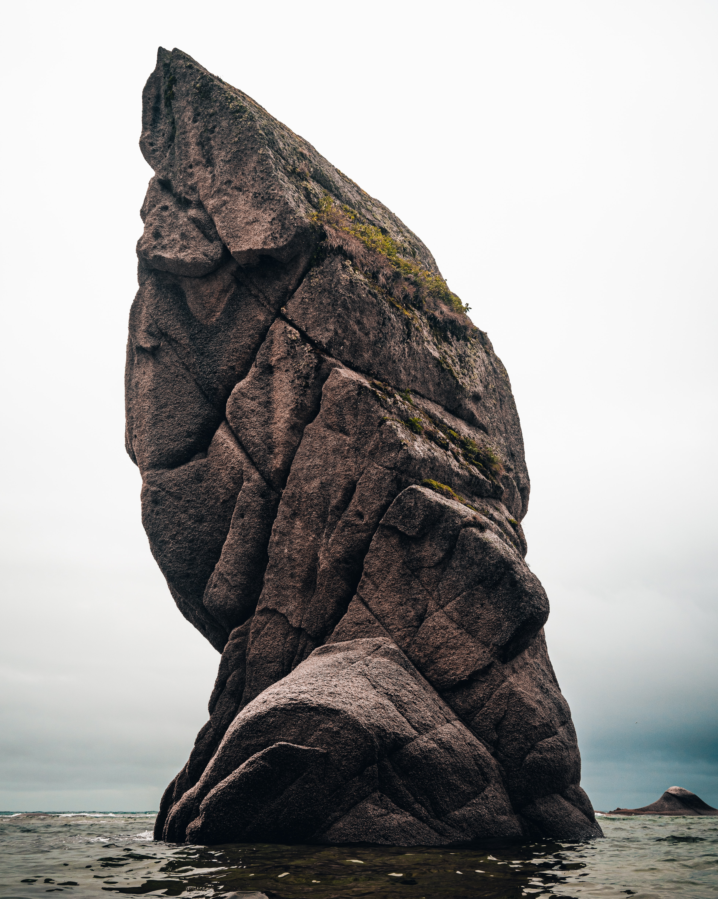

# about.md

`pixel-palettes/img/tests/natural/*`

Images are ordered by increasing complexity of subject matter, showcasing a variety of dominant colors. Photos are from [Unsplash](https://unsplash.com/license).

----------

01 - [apple](https://unsplash.com/photos/gDPaDDy6_WE) (red, white)  
02 - [rock](https://unsplash.com/photos/QTjMnpYUdXU) (brown, white)  
03 - [duck](https://unsplash.com/photos/K6Jh8T84J9Q) (green, brown, white)  
04 - [sunflowers](https://unsplash.com/photos/2IzoIHBgYAo) (yellow, blue, green)  
05 - [tiger](https://unsplash.com/photos/YuQgNYku1M8) (orange, brown, green)  
06 - [flowers](https://unsplash.com/photos/P4z15DCQ8-I) (green, yellow, pink, blue)  
07 - [reef](https://unsplash.com/photos/0G01UI1MQhg) (pink, blue, salmon, white, gray)  

----------

