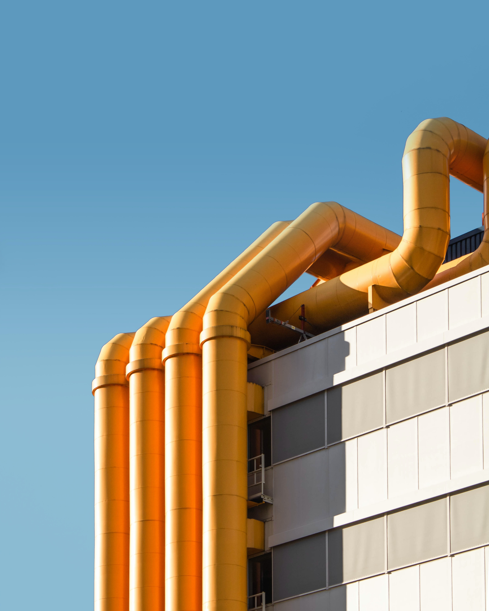
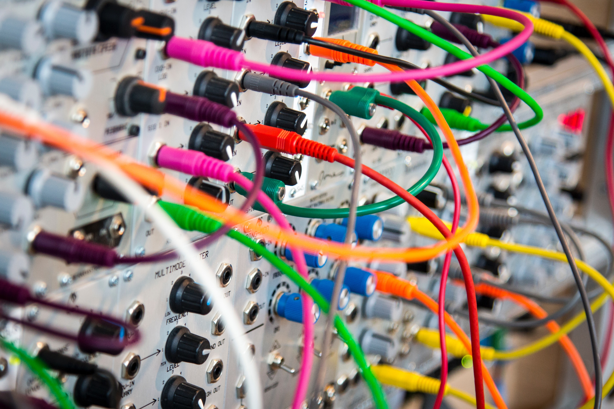

# about.md

`pixel-palettes/img/tests/synthetic/*`

Images are ordered by increasing complexity of subject matter, showcasing a variety of dominant colors. Photos are from [Unsplash](https://unsplash.com/license).

----------

01 - square (created in MS Paint using cyan, #00ffff)  
02 - [pipes](https://unsplash.com/photos/UoIiVYka3VY) (blue, yellow, white)  
03 - [bolts](https://unsplash.com/photos/qHhJkxare7A) (white, silver)  
04 - [circuit](https://unsplash.com/photos/tTurhPw9bwQ) (red, white)  
05 - [bridge](https://unsplash.com/photos/3k73te9YiVc) (yellow, blue, brown)  
06 - [wires](https://unsplash.com/photos/l090uFWoPaI) (white, green, yellow, orange, red, purple)  
07 - [city](https://unsplash.com/photos/Nyvq2juw4_o) (blue, orange, brown, gray)  

----------

