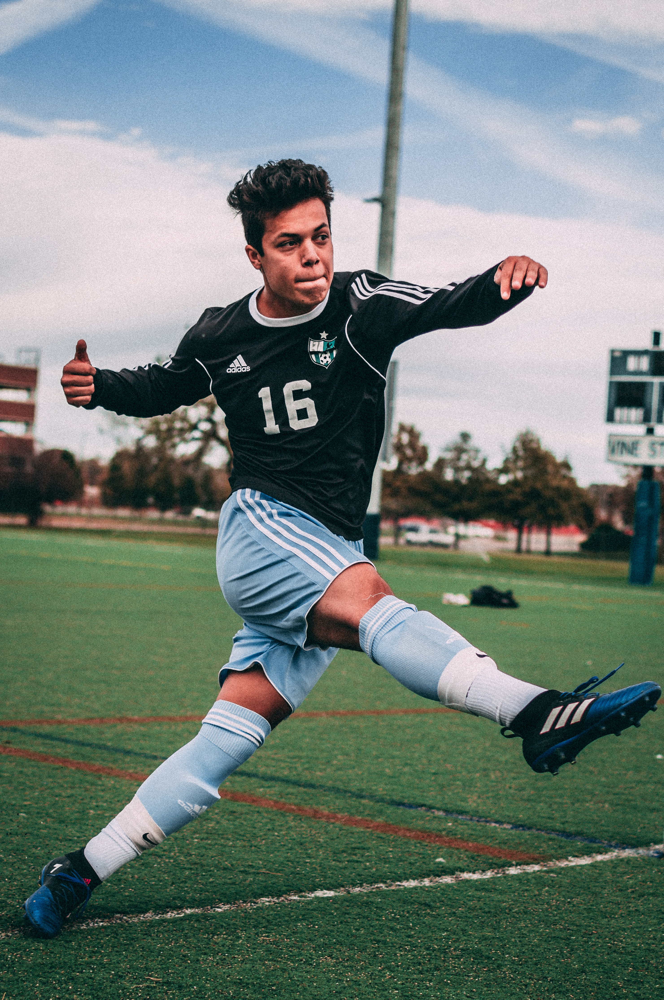

# about.md

`pixel-palettes/img/tests/human/*`

Images are ordered by increasing complexity of subject matter, showcasing a variety of dominant colors. Photos are from [Unsplash](https://unsplash.com/license). [Fitzpatrick scale](https://en.wikipedia.org/wiki/Fitzpatrick_scale?oldformat=true) used for skin tone classification when dominant colors.

----------

01 - [child](https://unsplash.com/photos/4U1x6459Q-s) (grayscale)  
02 - [woman](https://unsplash.com/photos/IF9TK5Uy-KI) (white, Type II)  
03 - [woman](https://unsplash.com/photos/xmSWVeGEnJw) (gray, black, Type V)  
04 - [man](https://unsplash.com/photos/N2IJ31xZ_ks) (gray, brown, Type VI)  
05 - [athlete](https://unsplash.com/photos/r-krWscXjvQ) (green, blue, black)  
06 - [couple](https://unsplash.com/photos/R0fRnLeQXOI) (beige, purple, red, white)  
07 - [students](https://unsplash.com/photos/iQPr1XkF5F0) (blue, white, pink, black)  

----------

